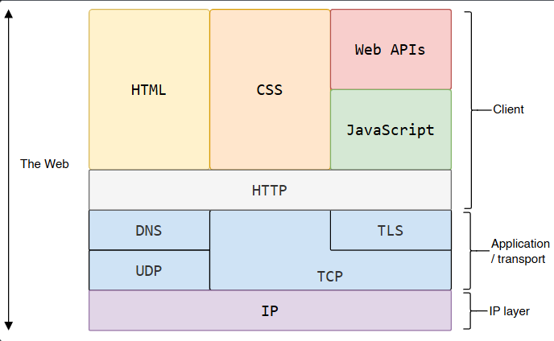
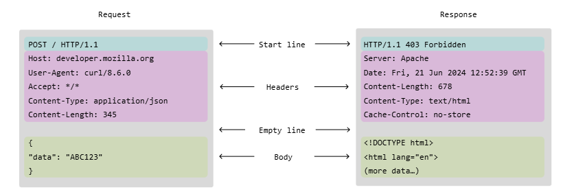
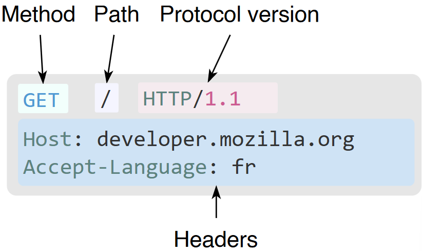
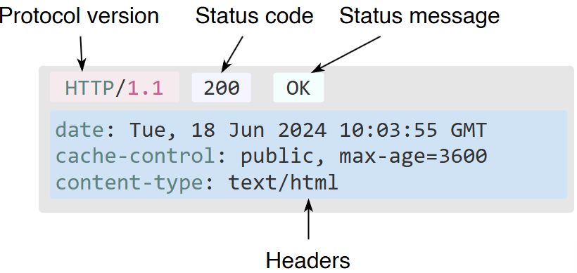

# Notes for HTTP server and Socket
via:https://developer.mozilla.org/en-US/docs/Web/HTTP

## Overview of HTTP
 - HTTP is a protocol for fetching resources such as html docs
 - client-server protocol,i.e. requests are initated by the recipient.

### The web architecutre


 - clients and servers communicate by exchaning individual messages. The messages sent by client are requests and messages by server are called response

### Components of HTTP-based systems
 - a client-server protocol: requests are sent by one entity, the user-agent(or a proxy).
 - between client and server there are numerous entities called proxies.
 - proxies perform different operations and act as gateways or caches.
 - browser alwasy initiates the request.
### Client: The user-agent
 - To display a webpage, browser sends an original request to fetch the html document
 - It then parses this file, making additional requests corresponding to execution scripts, layout info to display and sub-resources contained within the page 
### Web Server
 - Serves the doc requested by client,
 - appears as only a single machine virtually; can be a collection of servers
 - both can be on the single machine, with *HTTP/1.1* they can share same IP
### Proxies
 - Due to layered structure of the Web Stack, many of these operate at the transport, network, physical layer, becoming transparent at the HTTP layer
 -performs
     -> caching
     -> filtering
     -> load balancing
     -> authentication
     -> logging
---
## Basic Aspects of HTTP
 - HTTP is simple even HTTP/2 is simple can be read
 - can be extended
 - is stateless but not sessionless
### Stateless
 - Every request is independent.
 - The server does not remember previous requests.

### Session
Applications can create sessions using
- Cookies
- JWT
- Server-side session storage
Therefore HTTP itself is stateless, while applications built on HTTP can maintain user sessions.
---
## HTTP Flow
 - Open a TCP connection: The TCP connection is used to send a request, or several, and recieve an answer. Client can use a new one or open a preexisting one
 - Send an http message, they are of the form :-
``` HTTP
 GET / HTTP/1.1
 Host: developer.mozilla.org
 Accept-Language: fr
```
 - the server responds in the form as :-
``` HTTP
HTTP/1.1 200 OK
Date: Sat, 09 Oct 2010 14:28:02 GMT
Server: Apache
Last-Modified: Tue, 01 Dec 2009 20:18:22 GMT
ETag: "51142bc1-7449-479b075b2891b"
Accept-Ranges: bytes
Content-Length: 29769
Content-Type: text/html

<!doctype html>… (here come the 29769 bytes of the requested web page)
```
---
## HTTP messages
 - defined in HTTP/1.1 , are embedded into binary structure, a frame, allowing optimizations like compression of headers and multiplexing.
 
 - Format of Request:
 
 - Methods can be 
      -> GET
      -> POST
      -> OPTIONS
      -> HEAD
 - '/' is the path of resource to fetch; the URL of resrouce is stripped from elements which are obv
 - Format of response

 - a status code, indicates, if the req was successful or not and why 
 - status message, description of code
 - can have a body but has a header 
---
## Request Methods
 - GET: requests a data representation of specified resoruce
 - POST: method sends data to a server so it may change its state

## Response Methods
 - 200: OK. The request has succeeded
 - 301: Moved permanently. This response code mean that URI has changed
 - 404: Not Found

NOTE: there obv are more than these 
---
## Why HTTP server uses TCP
HTTP requires reliable delivery.

TCP guarantees

- ordered delivery
- error checking
- retransmission of lost packets

This allows HTTP to assume the request reaches the server intact.